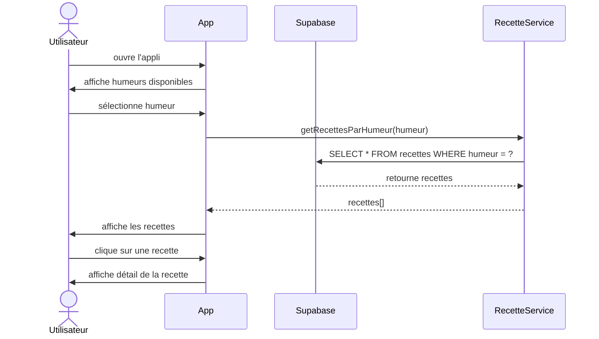

```mermaid
sequenceDiagram
    actor Utilisateur
    participant App
    participant Supabase
    participant RecetteService

    Utilisateur->>App: ouvre l'appli
    App->>Utilisateur: affiche humeurs disponibles
    Utilisateur->>App: sélectionne humeur
    App->>RecetteService: getRecettesParHumeur(humeur)
    RecetteService->>Supabase: SELECT * FROM recettes WHERE humeur = ?
    Supabase-->>RecetteService: retourne recettes
    RecetteService-->>App: recettes[]
    App->>Utilisateur: affiche les recettes
    Utilisateur->>App: clique sur une recette
    App->>Utilisateur: affiche détail de la recette
```