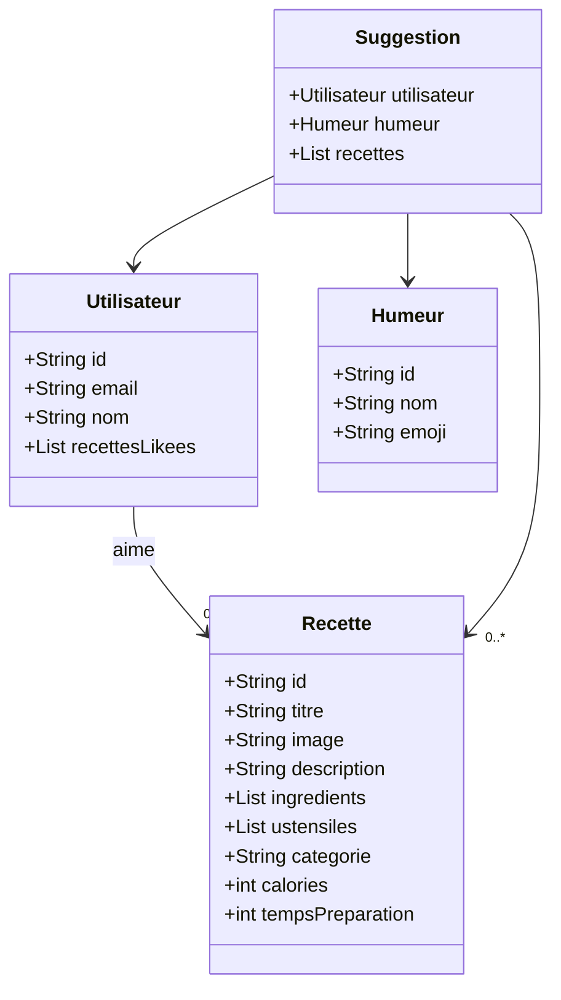

## 🧠 Diagramme de classes

```mermaid
classDiagram
    class Utilisateur {
        +String id
        +String email
        +String nom
        +List<Recette> recettesLikees
    }

    class Recette {
        +String id
        +String titre
        +String image
        +String description
        +List<String> ingredients
        +List<String> ustensiles
        +String categorie
        +int calories
        +int tempsPreparation
    }

    class Humeur {
        +String id
        +String nom
        +String emoji
    }

    class Suggestion {
        +Utilisateur utilisateur
        +Humeur humeur
        +List<Recette> recettes
    }

    Utilisateur --> "0..*" Recette : aime
    Suggestion --> Utilisateur
    Suggestion --> Humeur
    Suggestion --> "0..*" Recette
```